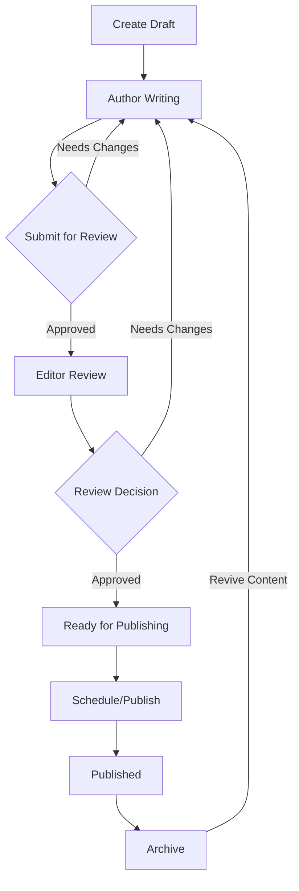

# Content Creation Flow

## Overview

The content creation system follows a structured workflow with multiple stages to ensure quality and proper review processes. Here's how content moves through the system:



## Detailed Flow

### 1. Content Creation (Draft Stage)
- Author creates new content using the admin dashboard
- System automatically saves as draft
- Features available:
  - Rich text editor with formatting
  - Media library integration
  - Content blocks system
  - SEO tools and suggestions
  - Auto-save functionality
  - Preview capability

### 2. Content Development
- Author can:
  - Edit and refine content
  - Add media elements
  - Structure content blocks
  - Set meta information
  - Add tags and categories
  - Save versions
  - Request informal feedback

### 3. Submit for Review
- Author completes content and submits for review
- System validates:
  - Required fields are filled
  - Minimum content length met
  - Media requirements satisfied
  - SEO elements completed
- Triggers notifications to editors

### 4. Editorial Review
- Editors can:
  - View submitted content
  - Add comments and suggestions
  - Request changes
  - Approve content
  - Assign to other editors
- Features available:
  - Track changes
  - Inline commenting
  - Version comparison
  - SEO validation
  - Quality metrics

### 5. Content Approval
- Multiple approval stages possible:
  - Editorial approval
  - SEO approval
  - Legal/compliance review (if needed)
- Each stage can:
  - Approve
  - Reject with comments
  - Request specific changes

### 6. Publishing
- Approved content can be:
  - Published immediately
  - Scheduled for later
  - Set for coordinated release
- System handles:
  - URL generation
  - SEO meta tags
  - Social media previews
  - Related content links
  - Analytics tracking setup

### 7. Post-Publication
- Content monitoring:
  - Performance tracking
  - User engagement metrics
  - SEO performance
  - Social shares
  - Comments/feedback
- Maintenance options:
  - Updates/edits
  - Archiving
  - Unpublishing
  - Content retirement

## Role-Based Permissions

### Authors
- Create new content
- Edit own drafts
- Submit for review
- View content status
- Access media library
- View analytics for own content

### Editors
- Review submitted content
- Edit any content
- Approve/reject submissions
- Manage editorial calendar
- Access all analytics
- Manage categories/tags

### Administrators
- Full system access
- Manage user roles
- Configure workflows
- Access all features
- View system reports
- Manage templates

## Key Features

### 1. Auto-save System
```typescript
// Auto-saves every 30 seconds
function autoSave() {
  const saveInterval = 30000;
  let timer: NodeJS.Timeout;
  
  return {
    start(content: any) {
      timer = setInterval(async () => {
        await saveRevision(content);
      }, saveInterval);
    },
    stop() {
      clearInterval(timer);
    }
  };
}
```

### 2. Version Control
```typescript
// Saves a new version
async function saveRevision(content: any) {
  const version = await getNextVersion(content.id);
  await db.contentRevisions.create({
    contentId: content.id,
    version,
    data: content,
    timestamp: new Date()
  });
}
```

### 3. Workflow Validation
```typescript
// Validates content before state transition
async function validateTransition(content: any, toState: string) {
  const validations = {
    review: () => validateForReview(content),
    approved: () => validateForApproval(content),
    published: () => validateForPublishing(content)
  };
  
  return validations[toState]();
}
```

## Integration Points

1. Media Management
   - Image optimization
   - Asset organization
   - File type validation
   - Storage management

2. SEO Tools
   - Keyword analysis
   - Meta tag generation
   - Structure data validation
   - Performance suggestions

3. Analytics
   - Content performance
   - User engagement
   - Search rankings
   - Social metrics

4. Notifications
   - Email alerts
   - In-app notifications
   - Slack integration
   - Mobile push notifications

## Best Practices

1. Content Creation
   - Use content templates
   - Follow style guides
   - Implement content blocks
   - Add proper meta data

2. Review Process
   - Use checklists
   - Provide specific feedback
   - Track changes history
   - Document decisions

3. Publishing
   - Review all elements
   - Check mobile rendering
   - Verify all links
   - Test social sharing

4. Maintenance
   - Regular content audits
   - Performance monitoring
   - Update outdated content
   - Archive irrelevant content

## Setup Requirements

1. Database Configuration
   - Content tables
   - Revision tracking
   - User permissions
   - Workflow states

2. Storage Configuration
   - Media storage
   - Backup system
   - CDN integration
   - Cache management

3. Service Configuration
   - Authentication
   - Email service
   - Search indexing
   - Analytics tracking

## Success Metrics

1. Content Quality
   - Editorial accuracy
   - SEO compliance
   - Media optimization
   - User engagement

2. Process Efficiency
   - Time to publish
   - Review cycles
   - Author productivity
   - Resource utilization

3. System Performance
   - Page load times
   - System uptime
   - API response times
   - Storage efficiency
